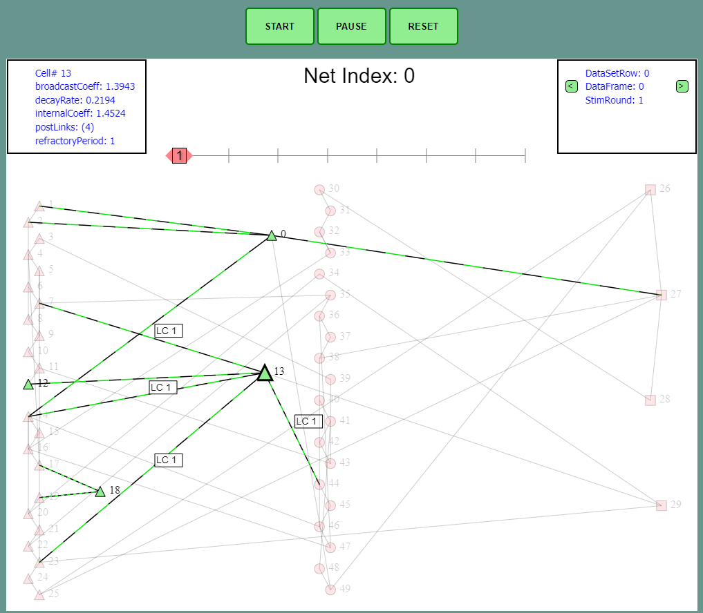

# Neural Net Viz

Visualize neural net activity for debugging and because... data is beautiful!



### Installing

Clone the repo
```
git clone https://github.com/Umitosan/neural_net_viz.git
```

## Usage

* 1. open index.html
* Note: the project comes with 2 sample json files for a demo
* 2. Load **"JSON/...read.json"** file using **"choose file"** button on the left side below the viewing area
* 3. Load **"JSON/...load.json"** file using **"choose file"** button on the left side below the viewing area
* 4. scroll up and click **"Start"**, (you should now see the visualization UI etc)
*  See Cell Details: use **left-mouse** and click on a cell
*  Navigate Stimulus Rounds: use **LEFT MOUSE** -OR- **LEFT and RIGHT arrrow keys** on the slider towards the top of the vis area
* Change Data Frame: use the **small < > buttons** in the upper-right corner status box -OR- use the **INPUT BOX** when mousing-over the status box


## Built With

* [jQuery](https://jquery.com/) - Basic DOM manipulation
* [Canvas](https://developer.mozilla.org/en-US/docs/Web/API/Canvas_API) - Graphics API

## Authors

* **Dom Brown** - *web app, visual design* - [github](https://github.com/Umitosan)
* **atoyndub** - *C++ back end (not in this repo)* - [github](https://github.com/atoyndub)

## License

This project's front end represented in this repo... is licensed under the MIT [LICENSE](LICENSE.md)
